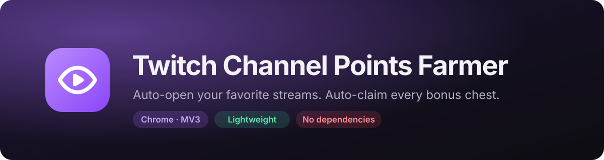

<p align="center">
  
</p>

<p align="center">
  
  
  
  
</p>

<p align="center">
  A tiny Chrome extension that watches your Twitch follows, opens the streams you care about the moment they go live,<br>
  keeps them as light as possible, and claims channel points for you.
</p>

---

## ✨ What it does

You pick channels from your follow list. The extension does the rest:

| | Feature | Details |
|---|---|---|
| 📡 | **Live detection** | Checks every minute which of your followed channels are live, using the official Twitch API. |
| 🚀 | **Auto-open** | Opens every enabled channel that is live, whether it just started or was already running. |
| 🪶 | **Lightweight mode** | Streams it opens are muted, forced to 160p, with the video and chat messages hidden. |
| 🎁 | **Auto-claim** | Clicks the channel points bonus chest as soon as it appears, on every Twitch tab. |
| 🧹 | **Auto-close** | Closes the tab when the stream ends or when you disable the channel. |
| 🔒 | **Private** | No server, no analytics. Your token stays in your browser and only talks to Twitch. |

## 📦 Installation

The extension is not on the Chrome Web Store, so you load it manually. It takes about three minutes.

### 1. Get the code

```bash
git clone https://github.com/RealThreat/twitch-channel-points-farmer.git
```

Or use **Code → Download ZIP** on GitHub and unzip it.

### 2. Load it in Chrome

1. Open `chrome://extensions`.
2. Turn on **Developer mode** (top-right corner).
3. Click **Load unpacked** and select the `twitch-channel-points-farmer` folder.
4. Pin the extension to your toolbar so you can reach it easily.

> Works in Chromium-based browsers (Chrome, Brave, Edge). Firefox is not supported.

### 3. Connect your Twitch account

The extension talks to the official Twitch API, which requires a free Client ID that you create yourself.

1. Click the extension icon. The setup screen shows a **redirect URL**; click **Copy**.
2. Click **Open Twitch console** (or go to [dev.twitch.tv/console/apps/create](https://dev.twitch.tv/console/apps/create)) and fill in the form:

   | Field | Value |
   |---|---|
   | **Name** | Anything unique. Twitch does not allow the word "Twitch" in the name. |
   | **OAuth Redirect URLs** | The URL you copied from the extension |
   | **Category** | Browser Extension |
   | **Client Type** | Public |

3. Create the application, open it, and copy its **Client ID**.
4. Paste the Client ID into the extension and click **Connect to Twitch**.
5. Approve the Twitch authorization prompt. The only permission requested is reading your follow list.

> [!NOTE]
> The redirect URL depends on the extension ID, which Chrome derives from the folder location. If you move the folder, the URL changes and you need to update it in the Twitch console.

## 🎮 Usage

1. **Click the extension icon** to see your followed channels. Live channels come first, sorted by viewers.
2. **Flip the switch** next to a channel to enable it. If it is live, it opens right away in a dedicated window.
3. **Leave that window open** behind your other windows. Do not minimize it: Chrome may pause playback in minimized windows, and you stop earning points.
4. **That's it.** New streams from enabled channels open on their own, and bonus chests are claimed automatically.

### The popup at a glance

| Element | Meaning |
|---|---|
| **Live** | Followed channels currently streaming |
| **Auto** | Channels you have enabled |
| **Open** | Streams the extension currently has open |
| **All / Live / Auto** tabs | Filter the list |
| ⟳ button | Scan immediately instead of waiting for the next minute |
| `Open` badge | The extension has a tab open for this channel |
| Number on the icon | How many streams are open right now |

### Good to know

- **Streams opened by an automatic scan appear in the background** so they don't interrupt you. Streams you enable from the popup bring the window to the front.
- **Closing a stream tab by hand** tells the extension to leave that channel alone until its next stream. Turn the switch off and on again to reopen it sooner.
- **Your regular Twitch tabs are untouched**: lightweight mode only applies to tabs the extension opened. Auto-claim works everywhere.

## ⚙️ How it works

```
┌──────────────┐  every minute   ┌──────────────────┐
│ background.js │ ───────────────▶│ Twitch Helix API │   which followed channels are live?
└──────┬───────┘                 └──────────────────┘
       │ opens / closes tabs
       ▼
┌──────────────┐
│  content.js  │   runs on twitch.tv: 160p, hidden video, clicks the bonus chest
└──────────────┘
```

| File | Role |
|---|---|
| `manifest.json` | Extension manifest (MV3) |
| `background.js` | Service worker: Twitch login, live scan, tab management |
| `content.js` | Runs on twitch.tv: lightweight mode and bonus claiming |
| `popup.html` / `popup.js` | The popup UI |

### Permissions

| Permission | Why |
|---|---|
| `storage` | Saves your Client ID, token and enabled channels locally |
| `alarms` | Runs the scan every minute |
| `tabs` | Opens, mutes and closes stream tabs |
| `identity` | Handles the Twitch login flow |
| `api.twitch.tv`, `id.twitch.tv` | Twitch API and login |
| `www.twitch.tv` | Lightweight mode and bonus claiming on stream pages |

## 🛠️ Troubleshooting

<details>
<summary><b>I enabled a channel but I don't see any stream</b></summary>

Streams open in a separate Chrome window, which may be behind your current one or on another desktop if Chrome is in full screen. Check the number on the extension icon: if it is not empty, the streams are open.
</details>

<details>
<summary><b>"Connection refused" when connecting</b></summary>

The redirect URL in the Twitch console must match the one shown in the extension exactly, including the trailing slash. Also check that the Client Type is <b>Public</b>.
</details>

<details>
<summary><b>Bonus chests are not being claimed</b></summary>

The claim relies on Twitch's page structure, which Twitch can change at any time. If it stops working, the selector in <code>content.js</code> needs an update. Also make sure the chat column is not collapsed: the chest lives there.
</details>

<details>
<summary><b>"Twitch session expired"</b></summary>

Twitch tokens last about two months. Log out with the button in the top-right corner of the popup, then connect again.
</details>

## ⚠️ Disclaimer

This project is not affiliated with or endorsed by Twitch. Automating viewing and point claiming may go against the Twitch Terms of Service. Use it at your own risk; you are responsible for what happens to your account.
